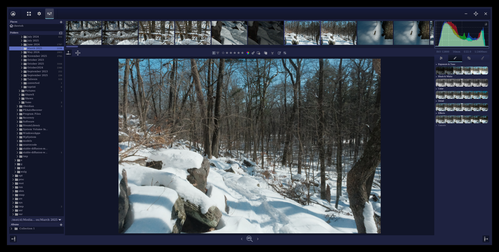
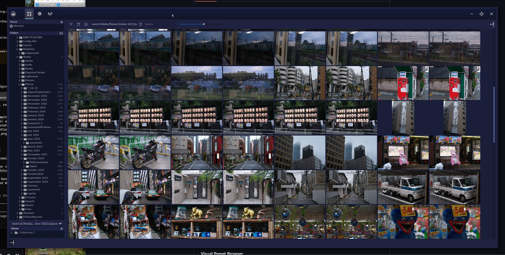

# Steep

**A modern, AI-enhanced fork of [RawTherapee](https://rawtherapee.com) for professional RAW photo editing.**

Steep takes the powerful open-source RAW processing engine of RawTherapee and adds a modernized interface, AI-powered tools, and professional-grade features inspired by industry-standard editors like Lightroom and DaVinci Resolve.

> **Status:** Active development. Core editing, export, and all original RawTherapee features work fully. New features (AI masking, AI denoise, watermarking, albums) are in various stages of completion. See [Feature Status](#feature-status) below.



---

## What's New in Steep

### Mode-Based Editor UI

The traditional multi-tab notebook interface has been replaced with a clean, mode-based layout using a **ModeButtonBar**:

| Mode | Purpose |
|------|---------|
| **Presets** | Visual preset browser with thumbnail previews |
| **Edit** | All editing tools organized into collapsible groups (Light, Color, Detail, Effects, Advanced, Calibration) |
| **Crop** | Transform tools (Crop, Resize, Lens Geometry, Rotation, Perspective, Distortion) |
| **Mask** | LocalLab selective editing with optional AI masks |

### Visual Preset Browser

Replaces the old tree-based profile selector with a card-based grid:

- Thumbnail previews of each preset's effect
- Quick-access cards for "Custom" and "Last Saved" states
- Category-based organization with collapsible sections
- Background thumbnail generation
- Full save/load/copy/paste workflow

### File Browser



### 3-Way Color Grading

Professional color grading tool with three interactive **color wheels** for shadows, midtones, and highlights:

- Per-range hue, saturation, and luminance control
- Global color wheel with luminance in an advanced section
- Blending and balance sliders for fine-tuning tonal splits
- Custom Cairo-rendered color wheel widget with double-click reset

### Point Color (Hue-Selective HSL)

Targeted color adjustments by hue range:

- Multiple independent color targets
- Per-target hue shift, saturation, luminance, and range controls
- Color picker to sample targets directly from the image
- Auto-generated color name labels

### AI Denoise

Integration with RawRefinery for AI-powered denoising:

- ISO conditioning control
- Blend slider to mix denoised result with original
- GPU acceleration toggle
- Background processing with cancel support
- Result caching per ISO level

### AI Semantic Masking (Optional)

Compile-time feature (`-DWITH_AI_MASKING=ON`) using ONNX Runtime for automatic subject detection:

- 9 semantic classes: background, person, sky, vegetation, building, vehicle, animal, foreground object
- Mask threshold, feather, blur, and opacity controls
- Edge refinement with configurable radius and epsilon
- DeepLabV3-MobileNetV3 model included
- Integrates with LocalLab for targeted adjustments on detected regions

### Watermarking

Full-featured watermark system applied at export:

- Custom text with font selection, size, bold/italic
- Text color with alpha transparency
- Stroke (outline) with configurable color and width
- Drop shadow with color, offset, and blur
- 9-point positioning grid with margin and rotation controls

### Album / Collection Management

Organize images beyond the filesystem:

- **Regular Albums** - manual image collections
- **Smart Albums** - rule-based auto-filtering by rating, color label, file type, camera, lens, ISO, focal length, aperture, or edited status
- **Folders** - organizational hierarchy for albums
- Persistent storage, global sync across all browser instances

### Floating History & Navigator

History and Navigator panels can be undocked into independent floating windows.

### New Themes

- **RawTherapee - Modern.css** - contemporary dark theme with updated styling
- **Rem.css** - fantasy-inspired dark theme (deep navy/indigo, cyan accents, copper details)

### Custom Icon Set

12+ new SVG icons for mode buttons, navigation, window controls, and album management.

---

## Feature Status

| Feature | Status |
|---------|--------|
| Mode-based editor UI | Working |
| Visual preset browser | Working |
| 3-way color grading | Working |
| Point color / HSL | Working |
| Watermarking | Working |
| Album browser | Working |
| Floating history/navigator | Working |
| New themes | Working |
| AI denoise (RawRefinery) | Working (requires external Python backend) |
| AI semantic masking | Experimental (requires ONNX Runtime, optional build flag) |
| All original RawTherapee features | Fully preserved |

---

## Building from Source

### Dependencies

Steep has the same base dependencies as RawTherapee, plus optional extras.

**Required (same as RawTherapee):**

- CMake >= 3.15
- GCC >= 4.9 (or Clang)
- GTK+ 3 / gtkmm 3.24
- libraw
- lensfun
- lcms2
- libiptcdata
- librsvg
- libtiff, libjpeg, libpng
- zlib
- expat
- fftw3

**Optional - AI Masking:**

- ONNX Runtime >= 1.17

**Optional - AI Denoise:**

- Python 3 with RawRefinery installed

### Linux

```bash
# Install dependencies (Debian/Ubuntu)
sudo apt install build-essential cmake git \
  libgtk-3-dev libgtkmm-3.0-dev \
  libraw-dev liblensfun-dev liblcms2-dev \
  libiptcdata0-dev librsvg2-dev \
  libtiff-dev libjpeg-dev libpng-dev \
  zlib1g-dev libexpat1-dev libfftw3-dev

# Clone
git clone https://github.com/cheetohsum/Steep.git
cd Steep

# Configure
mkdir build && cd build
cmake .. -DCMAKE_BUILD_TYPE=Release

# Optional: enable AI masking
# cmake .. -DCMAKE_BUILD_TYPE=Release -DWITH_AI_MASKING=ON

# Build
make -j$(nproc)

# Install
sudo make install
```

### Docker (with AI Masking)

A Dockerfile is provided for building with AI masking support:

```bash
docker build -f Dockerfile.aimasking -t steep-aimasking .
```

### Windows

Use MSYS2/MinGW or WSL. The project builds and runs under WSL2 with WSLg for display:

```bash
# Inside WSL2
mkdir build && cd build
cmake .. -DCMAKE_BUILD_TYPE=Release
make -j$(nproc)
sudo make install
rawtherapee
```

### macOS

```bash
# Install dependencies via Homebrew
brew install cmake gtk+3 gtkmm3 libraw lensfun little-cms2 \
  libiptcdata librsvg libtiff jpeg libpng fftw

mkdir build && cd build
cmake .. -DCMAKE_BUILD_TYPE=Release
make -j$(sysctl -n hw.ncpu)
sudo make install
```

---

## Project Structure

```
Steep/
  rtengine/          Processing engine (demosaic, color, denoise, etc.)
  rtgui/             GTK3 GUI application
    tools/           Editing tool panels (tonecurve, denoise, color grading, etc.)
    widgets/         Custom widgets (adjuster, color wheel, etc.)
    windows/         Dialog windows (preferences, history, navigator)
  rtdata/            Runtime resources
    themes/          CSS themes
    languages/       Localization files
    icons/           SVG icon sets
    models/          AI model files (ONNX)
  cmake/             CMake modules
  tools/             Build and utility scripts
```

---

## Acknowledgments

Steep is built on top of [RawTherapee](https://rawtherapee.com), an outstanding open-source RAW photo processor. All credit for the core processing engine, demosaicing algorithms, color management, and decades of refinement goes to the RawTherapee team and its contributors.

## License

GNU General Public License v3.0 - same as RawTherapee. See [LICENSE](LICENSE) for details.
